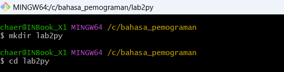
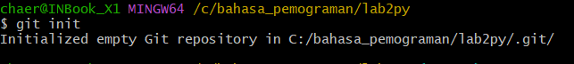
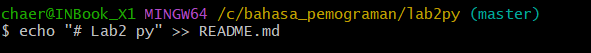
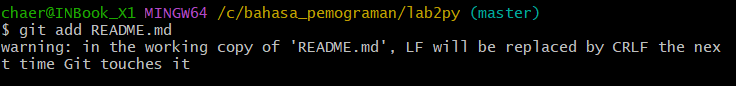

# Lab2 py

## tutorial git vcs

### kita membuat repositories

1.kita buat folder di pc kita 
2.kita ketik $mkdir latihan_buat untuk menambahkan folder 
3.kita pindah directory yg barusan kita buat dengan cara $cd lab2py  
  
4.kita akan inisilasisasi folder git dengan cara $git init  
 
5.kita menambahkan file baru pada repositori kita dengan cara $echo “# lab 2 py >> README.md. dan file README.md telah berhasil kita buat  
  
6.menambhkan file baru repository dengan cara $git add README.md  
  
